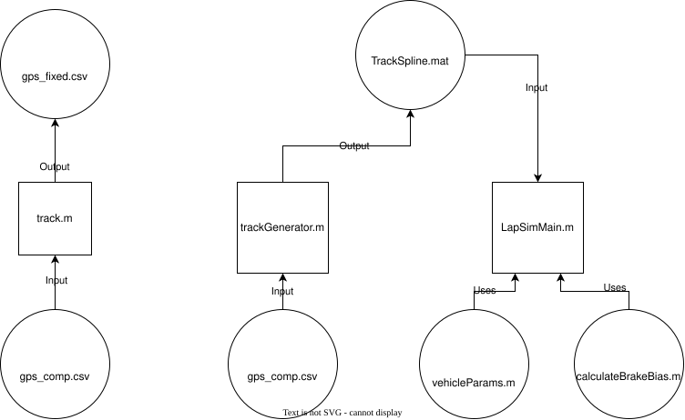

# Track simulation
# Goal of the project
Create a basic track simulation, simulate the car going along the endurance track at competition and provide an optimal lap time.

# What is endurance?
Endurance is a part of the fsae competition. It is ten laps around a track with one driver change in the middle. Points are assigned based on time to complete the ten laps and how many cones were hit (not important for the sim, but fun to know). In 2026 competition, MF13 achieved time of 1509.953 seconds, which is about 151 seconds per lap.

# Current setup

LapSimMain.m: Takes the points, and determines the fastest possible time accross the lap, generating a graph of the track
    Inputs: TrackSpline.mat

TrackImperical.dxf: the track trace/spline

TrackSpline.mat: the spline converted into points

calculateBrakeBias.m: calculate brake bias given
    Inputs: v (velocity across the track), dt (change of time between the points on the track)

debug.m: loads mat files into the workspace to view it

fsaetrack.xlsx: input for track.m (set of points on the track)

fsaetrack_fixed.xlsx: output for track.m (filtered track)

gps_comp.csv: gps from competition 2026

track.m: takes in a track, smooths the points out, and shows an animation of a point tracing the track
    Inputs: fsaetrack.xslx
    Outputs: fsaetrack_fixed.xslx

trackGenerator.m: Takes the spline, and smooths it to points for the track sim.
    Inputs: TrackImperical.dxf
    Outputs: TrackSpline.mat

vehicleParams.m: vehicle parameters such as acceleration/deceleration for 

Main track sim setup: read in the dxf file drawn by hand in oneshape, generate into one spline(track generator), read by track sim
track.m: trace the track
Includes brake simulation for reviewing brake biases across the track. 
All values are in imperical system (speed: ft/s, acceleration: ft/s^2)

# Work to be done

Move away from dxf file, replace it with gps data from competition (gps_comp.csv)

MF13 lap time average: 151s
